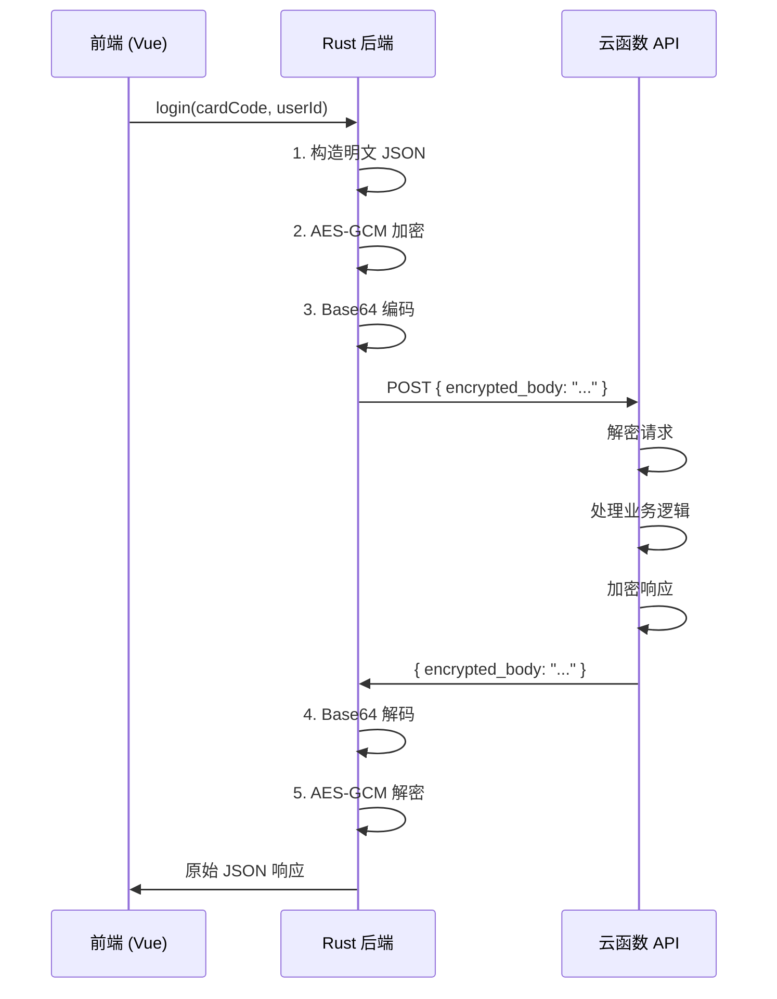

# 设计文档

## 概述

为卡密校验接口添加 AES-256-GCM 加密层，在 Tauri Rust 后端实现请求加密和响应解密，前端无需修改。采用对称加密方案，客户端和服务端共享密钥。

## 架构



## 组件和接口

### 1. 加密模块 (`src-tauri/src/crypto.rs`)

```rust
/// AES-256-GCM 加密
/// 输入：明文字符串，密钥（32字节）
/// 输出：Base64(Nonce + Ciphertext + AuthTag)
pub fn encrypt(plaintext: &str, key: &[u8; 32]) -> Result<String, CryptoError>

/// AES-256-GCM 解密
/// 输入：Base64 编码的密文，密钥（32字节）
/// 输出：明文字符串
pub fn decrypt(ciphertext_b64: &str, key: &[u8; 32]) -> Result<String, CryptoError>
```

### 2. 加密 HTTP 请求命令 (`src-tauri/src/utils.rs`)

```rust
/// 加密 HTTP POST 请求
/// 自动加密请求体，解密响应体
#[tauri::command]
pub async fn http_post_encrypted(url: String, body: String) -> Result<String, String>
```

### 3. 错误类型

```rust
pub enum CryptoError {
    InvalidKeyLength,      // 密钥长度错误
    Base64DecodeError,     // Base64 解码失败
    InvalidCiphertext,     // 密文格式错误（长度不足）
    DecryptionFailed,      // 解密失败（认证标签不匹配）
    EncryptionFailed,      // 加密失败
}
```

## 数据模型

### 加密请求格式

```json
{
  "encrypted_body": "Base64(Nonce[12] + Ciphertext + AuthTag[16])"
}
```

### 加密响应格式

```json
{
  "encrypted_body": "Base64(Nonce[12] + Ciphertext + AuthTag[16])"
}
```

### 密文结构

| 字段 | 长度 | 说明 |
|------|------|------|
| Nonce | 12 字节 | 随机数，每次加密不同 |
| Ciphertext | 可变 | 加密后的数据 |
| AuthTag | 16 字节 | 认证标签，用于验证完整性 |

## 正确性属性

*属性是系统在所有有效执行中应保持为真的特征或行为——本质上是关于系统应该做什么的形式化陈述。属性是人类可读规范和机器可验证正确性保证之间的桥梁。*

### Property 1: 加密解密往返一致性（Round-trip）

*对于任意* 有效的明文字符串和 32 字节密钥，加密后再解密应该得到与原始明文完全相同的结果。

```
∀ plaintext, key: decrypt(encrypt(plaintext, key), key) == plaintext
```

**验证: 需求 2.1, 2.2, 2.3, 2.4**

### Property 2: 加密输出格式正确性

*对于任意* 有效的明文字符串，加密输出应该是有效的 Base64 字符串，解码后长度至少为 28 字节（12 字节 Nonce + 16 字节 AuthTag）。

```
∀ plaintext, key: 
  let output = encrypt(plaintext, key)
  base64_decode(output).length >= 12 + 16
```

**验证: 需求 1.2, 1.3**

### Property 3: 相同明文产生不同密文

*对于任意* 有效的明文字符串，连续两次加密应该产生不同的密文（因为 Nonce 随机）。

```
∀ plaintext, key:
  encrypt(plaintext, key) != encrypt(plaintext, key)
```

**验证: 需求 1.2**

## 错误处理

| 错误场景 | 错误类型 | 错误信息 |
|----------|----------|----------|
| 密钥长度不是 32 字节 | InvalidKeyLength | "密钥长度必须为 32 字节" |
| Base64 解码失败 | Base64DecodeError | "Base64 解码失败" |
| 密文长度小于 28 字节 | InvalidCiphertext | "密文格式错误：长度不足" |
| AES-GCM 认证失败 | DecryptionFailed | "解密失败：数据可能被篡改" |

## 测试策略

### 单元测试

1. 加密函数基本功能测试
2. 解密函数基本功能测试
3. 错误处理测试（各种边界条件）

### 属性测试

使用 `proptest` 库进行属性测试：

1. **Round-trip 属性测试**：生成随机字符串，验证加密后解密还原
2. **输出格式属性测试**：验证加密输出符合预期格式
3. **Nonce 随机性测试**：验证相同输入产生不同输出

测试配置：每个属性测试运行至少 100 次迭代。

### 边界条件测试

- 空字符串加密
- 超长字符串加密
- 包含特殊字符（Unicode、emoji）的字符串
- 无效 Base64 输入
- 被篡改的密文

## 依赖

```toml
# Cargo.toml 新增依赖
aes-gcm = "0.10"      # AES-GCM 加密
base64 = "0.22"       # Base64 编解码
rand = "0.8"          # 随机数生成（用于 Nonce）
proptest = "1.4"      # 属性测试（dev-dependency）
```
